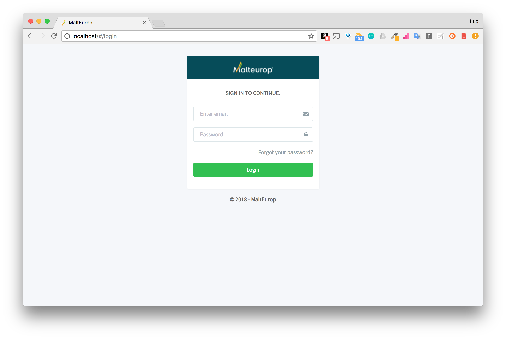
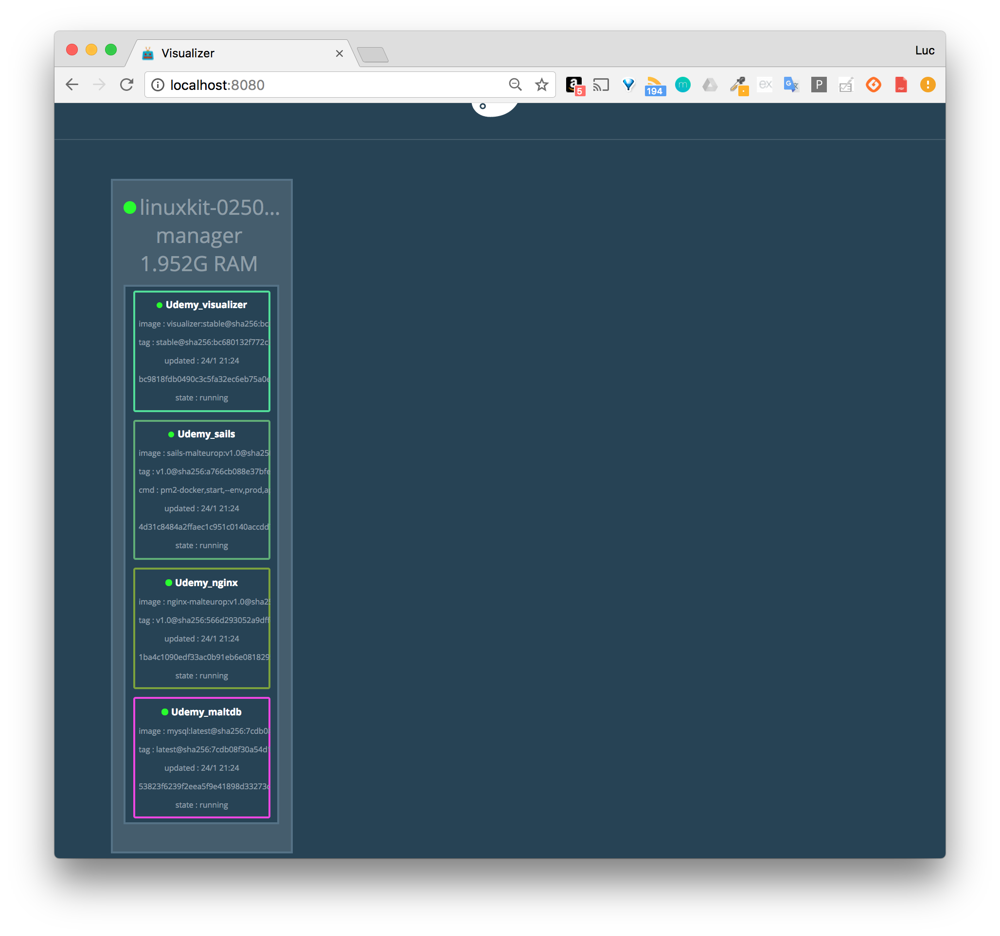

## Lancement de la stack

```
$ docker stack deploy -c docker-compose.yml

Ignoring unsupported options: build, restart

Creating network Udemy_default
Creating service Udemy_visualizer
Creating service Udemy_nginx
Creating service Udemy_sails
Creating service Udemy_maltdb
```

## List running services

```
$ docker stack ls
NAME                SERVICES
Udemy               4
```

```
$ docker service ls
ID                  NAME                MODE                REPLICAS            IMAGE                             PORTS
3nd2v4wuargt        Udemy_maltdb        replicated          1/1                 mysql:latest                      *:3336->3306/tcp
lhxoqa7vkyfp        Udemy_nginx         replicated          1/1                 adixonfr/nginx-malteurop:v1.0     *:80->80/tcp,*:443->443/tcp
dteysd76wxtj        Udemy_sails         replicated          1/1                 adixonfr/sails-malteurop:v1.0     *:1337->1337/tcp
1xjm6j0nql2c        Udemy_visualizer    replicated          1/1                 dockersamples/visualizer:stable   *:8080->8080/tcp
```

## Login page



## Visualizer


